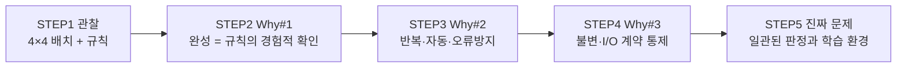

# 4x4 magic square problem definition
_Exported on 5/28/2026 at 14:03:00 GMT+9 from Cursor (3.5.17)_

---

**User**

당신은 문제 정의 전문가입니다.
나는 4x4 Magic Square 프로그램을 만들려고 합니다.
하지만 바로 설계하거나 구현하지 마십시오.
먼저 문제 인식 단계부터 진행하십시오.
--------------------------------------------
STEP 1 — Observation (관찰)
--------------------------------------------
다음 질문에 답하십시오:
1. 현재 우리가 해결하려는 상황은 무엇인가?
2. 왜 4x4 마방진 문제를 다루는가?
3. 이 문제는 어떤 학습 또는 시스템 설계 맥락에서 등장하는가?
“마방진을 만든다”는 표현 대신,상황을 관찰 관점으로 서술하십시오.

---

**Cursor**

프로젝트 맥락을 파악한 뒤, 관찰 단계에 맞게 상황을 서술하겠습니다.

# STEP 1 — Observation (관찰)

워크스페이스(`MagicSquare_`)에는 아직 코드나 문서가 없습니다. 따라서 아래는 **지금 관찰 가능한 사실**과 **아직 열린 질문**을 구분해 서술합니다.

---

## 1. 현재 우리가 해결하려는 상황은 무엇인가?

**관찰된 상황**

- 누군가(사용자)가 **4×4 격자**와 관련된 **규칙을 만족하는 배치**를 다루려는 의도를 표현했습니다.
- 그 의도는 아직 **구체적인 요구(입력·출력·제약·사용자)**로 고정되지 않았고, **“문제를 먼저 정의하자”**는 절차적 선택이 먼저 나타났습니다.
- 작업 공간 이름만으로 보면, 이후 **프로그램 형태의 산출물**을 둘 **작업 흔적의 시작점**이 마련된 상태입니다.

**아직 관찰되지 않은 것(열린 질문)**

- “해결”이 **하나의 정답을 찾는 것**인지, **모든 해를 나열하는 것**인지, **사용자가 직접 채우는 도구**인지, **규칙 검증만 하는 것**인지는 관찰 단계에서 확정되지 않았습니다.
- 4×4가 **고정 크기**인지, **학습용으로 4만 다루는 것**인지도 아직 드러나지 않았습니다.

**관찰 관점의 한 줄 요약**  
→ *“4×4 격자에 숫자(또는 값)를 배치할 때, 특정 합·대칭·중복 없음 같은 규칙과의 관계를 다루려는 미정의 과제가 시작되었다.”*

---

## 2. 왜 4×4 마방진 문제를 다루는가?

**직접 관찰 가능한 이유**

- 사용자가 **4×4**와 **마방진(Magic Square)**이라는 **명시적 범위**를 제시했습니다. 즉, 문제 영역이 “임의 크기 격자”가 아니라 **작고 완결된 인스턴스**로 좁혀졌습니다.

**추정 가능하나 아직 확인되지 않은 이유(가설, 관찰 메모)**

| 가설 | 관찰 근거 |
|------|-----------|
| **학습·연습** | 구현 전에 “문제 인식” 단계를 요청함 → 알고리즘·요구정의 연습 맥락 가능 |
| **복잡도 관리** | 3×3은 해가 적고, 5×5 이상은 방법·검증이 무거워짐 → 4×4는 “손으로도, 코드로도” 다루기 쉬운 중간 크기 |
| **짝수 차 마방진의 특성** | 4는 짝수 차(order 4)로, 홀수 차(Siamese 등)와 **생성·증명·구현 논리가 달라짐** → 설계·알고리즘 학습에 자주 쓰임 |
| **검증·테스트 용이** | 행·열·대각선 합 등 **불변량이 명확**해 자동 검증·단위 테스트 설계 연습에 적합 |

**관찰 관점의 한 줄 요약**  
→ *“범위가 작고 규칙이 명확한 격자 배치 문제를, 구현 전에 정의·관찰·학습 절차로 다루기 위해 4×4 인스턴스가 선택된 것으로 보인다(최종 동기는 사용자 확인 전까지 가설).”*

---

## 3. 이 문제는 어떤 학습 또는 시스템 설계 맥락에서 등장하는가?

**학습 맥락에서 자주 보이는 위치**

- **수학·조합**: 불변량(매직 상수), 순열·제약 만족, 대칭·회전 동치
- **알고리즘 입문**: 백트래킹, 제약 propagation, 브루트포스 vs 구조적 생성(짝수 차 분할 등)
- **소프트웨어 공학 입문**: 요구사항 → 명세 → 검증 함수 → UI/CLI 분리
- **테스트·품질**: “올바른 배치”에 대한 **판정기(oracle)** 설계

**시스템 설계 맥락에서의 등장 방식(아직 시스템은 없음)**

- **도메인 규칙 엔진**: “배치가 유효한가?”를 중심 모듈로 두는 구조
- **생성 vs 검증 분리**: 만들기(generate)와 확인(validate)를 다른 책임으로 나누는 경계
- **상태 공간 탐색**: 4×4는 상태 수가 커도 **완전 탐색·휴리스틱** 논의가 가능한 스케일
- **교육용·데모용 앱**: 격자 UI, 힌트, 단계별 피드백 — “퍼즐”로서의 시스템

**관찰 관점의 한 줄 요약**  
→ *“격자 배치 + 합·중복·대칭 규칙이라는 작은 도메인을, 알고리즘·검증·요구정의·UI 중 어디에 초점을 둘지 실험하기 좋은 교육용 문제 인스턴스로 자주 등장한다.”*

---

## 관찰 단계에서의 정리(설계·구현 없음)

| 관찰 항목 | 현재 상태 |
|-----------|-----------|
| 산출물 형태 | “프로그램” 의도는 있으나 종류(CLI/GUI/라이브러리) 미정 |
| 문제 핵심 | 4×4 격자 위 값 배치와 **규칙과의 일치 여부** |
| 진행 방식 | 구현보다 **문제 정의·관찰** 우선 |
| 불확실성 | 목적(생성/탐색/퍼즐/증명)과 최종 사용자 미확정 |

---

다음 단계(STEP 2 — Problem framing 등)로 가기 전에, 관찰을 **사실로 고정**하려면 아래만 짧게 알려주시면 됩니다.

1. 이 프로그램의 **주 사용자**는 누구인가요? (본인 학습, 수업, 일반 사용자 등)  
2. **입력**은 무엇이고 **기대 결과**는 무엇인가요? (예: 빈 칸 채우기, 랜덤 생성, 해 존재 여부만 확인)  
3. 숫자 범위는 **1~16 연속** 같은 전통적 마방진인가요, 아니면 다른 규칙인가요?

원하시면 STEP 2에서 “문제 문장(Problem statement)”만 다루겠습니다. 구현·설계는 계속 하지 않겠습니다.

---

**User**

다음 단계(STEP 2 — Problem Framing 등)로 넘어가려면, 예를 들어 “사용자가 직접 칸을 채우는 퍼즐인지 / 프로그램이 자동으로 보여주는 데모인지” 같은 목적을 함께 좁히면 관찰을 문제 정의로 연결하기 좋습니다. 원하시면 STEP 2를 이어서 진행하겠습니다.
와 같은 내용을 제시합니다.

--------------------------------------------
STEP 2 — Why #1
--------------------------------------------
Q: 왜 마방진을 완성해야 하는가?
A를 가정하여 답하고, 그 답에서 드러나는 불편함 또는 구조적 문제를 분석하십시오.
--------------------------------------------
STEP 3 — Why #2
--------------------------------------------
Q: 왜 단순 계산이 아니라 프로그램으로 구현하는가?
다음 관점에서 답하십시오:
- 반복 가능성
- 검증 자동화
- 오류 방지
- 규칙 기반 사고 훈련
 

--------------------------------------------
STEP 4 — Why #3 (핵심 발견)
--------------------------------------------
Q: 왜 이 문제를 TDD 방식으로 설계하려 하는가?
- 무엇이 통제되어야 하는가?
- 어떤 불변 조건이 존재하는가?
- 왜 입력/출력이 명확해야 하는가?
 

--------------------------------------------
STEP 5 — 진짜 문제 정의
--------------------------------------------
다음을 작성하십시오:
1. 표면 문제 정의 (잘못된 정의)
2. 개선된 문제 정의 (정확한 정의)
3. 이 문제의 핵심 Invariant
4. 우리가 실제로 훈련하려는 사고 능력
−	구현 설계는 하지 마십시오.
−	코드 언급 금지.
−	알고리즘 설명 금지.
−	구조화된 Markdown으로 작성하십시오.

---

**Cursor**

STEP 2~5는 **가정을 명시한 뒤** 문제 정의로 이어갑니다. STEP 1에서 열린 “목적”은 아래처럼 좁혀 두었습니다.

**가정(Problem Framing 전제)**  
- 주 사용 맥락: **학습·연습**  
- 주요 상호작용: 사용자가 4×4 격자에 값을 배치하고, **규칙 충족 여부를 확인**하며 완성에 가까워지는 **퍼즐형 경험**  
- 전통적 범위: **1부터 16까지 각각 한 번**, 행·열·두 대각선의 합이 동일  

(데모만 보여주는 형태가 아니라, **판정·피드백이 있는 연습**을 전제로 Why를 전개합니다.)

---

# STEP 2 — Why #1

## Q: 왜 마방진을 완성해야 하는가?

### 가정한 답(A)

> **“16칸에 숫자를 올바르게 배치했을 때, 여러 줄의 합이 동시에 맞는다는 것을 직접 확인하고, 그 규칙을 몸으로 이해하기 위해 완성 과정을 거친다.”**

완성은 **점수를 얻기 위한 게임 목표**라기보다, **“여러 제약이 한꺼번에 성립하는 배치”를 경험으로 확인하는 학습 목표**에 가깝다고 본다.

### 이 답에서 드러나는 불편함·구조적 문제

| 유형 | 내용 |
|------|------|
| **인지 부하** | 행·열·대각선·중복 없음을 **동시에** 머릿속으로 추적하기 어렵다. 한 줄만 맞춰도 다른 줄이 깨지는 경우가 잦다. |
| **피드백 지연** | 손계산이나 눈검사만으로는 “지금 어디가 틀렸는지”가 **즉시·정확히** 드러나지 않는다. |
| **오류 누적** | 초반에 작은 실수(중복, 범위 벗어남)가 나중 합 검증에서야 발견되면, **어느 단계에서 잘못됐는지** 되돌리기 비용이 크다. |
| **완성 기준 모호** | “거의 맞음”과 “완전히 맞음”의 경계가 사람마다 다르다. **완성의 정의**가 공유되지 않으면 학습 목표 달성 여부를 논할 수 없다. |
| **반복 학습 비용** | 같은 규칙을 다시 연습할 때마다 검산·대조를 **처음부터** 반복해야 한다. |
| **구조적 난이도(4×4)** | 크기는 작지만 제약이 **서로 얽혀** 있어, “한 규칙만 만족”하는 부분 해가 **전체 해처럼 보이는 함정**이 생긴다. |

### 구조적 문제 요약

완성을 **목표**로 두면, 실제로 막히는 지점은 “16개 숫자 배치” 자체보다  
**다중 제약의 동시 만족을 사람이 안정적으로 추적·판정·되돌리기 어렵다**는 점이다.

---

# STEP 3 — Why #2

## Q: 왜 단순 계산이 아니라 프로그램으로 구현하는가?

### 1. 반복 가능성

- 같은 4×4 상태에 대해 **동일한 기준**으로 몇 번이든 다시 판정할 수 있다.  
- 연습 세션을 나눠도 **판정 규칙이 흔들리지 않는다**.  
- “이번엔 대각선만 확인했다” 같은 **불완전한 반복**을 줄인다.

### 2. 검증 자동화

- 행·열·대각선·중복·범위 등 **여러 검사를 한 번에** 적용할 수 있다.  
- 사람이 놓치기 쉬운 항목(대각선, 중복)을 **누락 없이** 매번 검사한다.  
- “완성됨 / 미완성 / 어떤 제약 위반”을 **일관된 결과**로 돌려줄 수 있다.

### 3. 오류 방지

- 합계 계산 실수, 같은 숫자 두 번 넣기, 범위 밖 값 등 **기계적 실수**를 줄인다.  
- 학습자는 **산술·기록 오류** 대신 **배치 전략과 규칙 이해**에 집중할 수 있다.  
- 잘못된 상태를 “맞는 것처럼” 오래 유지하는 **가짜 진행**을 줄인다.

### 4. 규칙 기반 사고 훈련

- “맞다/틀리다”를 **감각**이 아니라 **명시된 규칙 집합**에 대응시키는 습관을 기른다.  
- 문제를 **입력(현재 격자 상태) → 출력(판정·설명)** 으로 나누는 연습이 된다.  
- 나중에 요구사항·테스트·모듈 경계로 옮기기 쉬운 **사고 단위**를 만든다.

### Why #2 한 줄 정리

단순 계산은 **한 번의 검산**에 그치기 쉽고, 프로그램은 **규칙의 반복·자동·일관 적용**을 통해 학습과 연습의 **품질과 속도**를 올리려는 선택이다.

---

# STEP 4 — Why #3 (핵심 발견)

## Q: 왜 이 문제를 TDD 방식으로 설계하려 하는가?

### 무엇이 통제되어야 하는가?

| 통제 대상 | 이유 |
|-----------|------|
| **“완성”의 의미** | 부분적으로 맞은 격자와 완전히 맞은 격자를 구분해야 학습 목표가 성립한다. |
| **판정 규칙** | 어떤 조건을 만족해야 성공인지가 **팀·시간·구현자**마다 달라지면 안 된다. |
| **입력의 유효 범위** | 빈 칸, 중복, 범위 밖 값 등 **허용·거부** 기준이 고정되어야 한다. |
| **피드백의 의미** | “틀림”이 **어떤 제약 위반**인지 결과가 예측 가능해야 한다. |
| **변경의 영향** | 규칙을 하나 추가·수정할 때 **기존에 맞던 예시가 깨지는지** 바로 알 수 있어야 한다. |

TDD는 기능 구현 속도보다, **규칙이 의도대로 고정·회귀 없이 유지되는지**를 통제하려는 설계 태도다.

### 어떤 불변 조건(Invariant)이 존재하는가?

(도메인 불변 — “항상 참이어야 하는 성질”)

1. **범위·유일성**: 사용된 값은 정해진 집합(예: 1~16)에 속하며, 완성 상태에서는 각 값이 정확히 한 번씩만 나타난다.  
2. **매직 합**: 완성 상태에서는 모든 행, 모든 열, 지정된 대각선들의 합이 **하나의 동일한 목표 합**과 같다.  
3. **완성도와 판정의 일치**: “완성”으로 표시되면 위 조건이 모두 참이고, 하나라도 거짓이면 “완성”이 아니다.  
4. **판정의 결정성**: 같은 격자 상태에 대해 판정 결과는 **항상 동일**하다.  
5. **부분 상태의 명확성**: 빈 칸이 있거나 중복·범위 위반이 있으면, “완성” 판정은 내리지 않거나, 그에 맞는 **별도 상태**(미완성·오류)로 분류된다.

이 불변들은 **수학적 성질**이면서 동시에 **시스템이 지켜야 할 계약**이다.

### 왜 입력/출력이 명확해야 하는가?

| 이유 | 설명 |
|------|------|
| **테스트 가능성** | 주어진 격자 상태(입력)에 대해 기대 판정(출력)을 **사전에 적어 둘 수** 있어야 한다. |
| **경계 분리** | “사용자가 무엇을 넣었는가”와 “시스템이 무엇을 말하는가”가 섞이면 책임이 불명확해진다. |
| **회귀 방지** | 규칙 변경 시 **어떤 예시가 깨졌는지** 입력·출력 쌍으로 추적할 수 있다. |
| **학습 목표 정렬** | 학습자는 출력(완성 여부, 위반 종류)만 보고도 **다음 행동**을 정할 수 있다. |
| **모호성 제거** | “대충 맞음”, “거의 완성” 같은 **비형식적 판단**을 제거한다. |

### Why #3 핵심 발견

TDD를 택하는 이유는 “테스트 코드를 많이 쓰기 위해서”가 아니라,  
**마방진 문제의 본질이 ‘다중 불변 조건을 동시에 만족하는가?’라는 계약 문제**이기 때문이다.  
구현 전에 **입력(격자 상태)·출력(판정)·불변(완성 조건)** 을 고정해야, 학습·연습·자동 검증이 **같은 문제**를 가리킨다.

---

# STEP 5 — 진짜 문제 정의

## 1. 표면 문제 정의 (잘못된 정의)

> **“4×4 마방진을 만드는 프로그램을 만든다.”**

**왜 잘못된가**

- “만든다”가 **생성·퍼즐·데모·검증** 중 무엇인지 불명확하다.  
- 성공 기준(완성, 부분 점수, 힌트 등)이 없다.  
- 사용자 가치(학습, 놀이, 시연)가 빠져 있다.  
- **불변 조건**과 **판정 책임**이 정의에 포함되지 않는다.

---

## 2. 개선된 문제 정의 (정확한 정의)

> **“학습자가 제시한 4×4 격자 상태가, 정해진 마방진 규칙(값의 범위·유일성, 행·열·대각선 합 일치)을 모두 만족하는지를 일관되게 판정하고, 그 결과를 명확한 피드백으로 제공하는 연습 환경을 정의·보장한다.”**

**포함되는 것**

- **대상**: 임의 시점의 격자 상태(비어 있거나 채워진 상태 포함 가능 — 범위는 별도 명세로 고정)  
- **핵심 행위**: 규칙에 따른 **판정** (및 필요 시 위반 유형 구분)  
- **품질 요구**: 같은 입력 → 같은 출력, 완성 정의와 불변의 일치  
- **목적**: 사람의 검산 부담을 줄이고, **규칙 이해·규칙 기반 사고**를 훈련  

**의도적으로 아직 넣지 않은 것**

- 화면 형태, 생성 방법, 힌트 전략, 최적 해 탐색 등 **구현·알고리즘 선택**

---

## 3. 이 문제의 핵심 Invariant

| ID | Invariant (불변 조건) |
|----|-------------------------|
| I1 | 완성으로 인정되는 배치에서만, 허용 값 집합의 원소가 **정확히 한 번씩** 사용된다. |
| I2 | 완성으로 인정되는 배치에서, 모든 관련 행·열·대각선의 합이 **동일한 단일 값**이다. |
| I3 | “완성” 판정은 I1·I2를 **모두** 만족할 때만 참이다. |
| I4 | 동일한 격자 상태에 대한 판정 결과는 **항상 동일**하다. |
| I5 | I1 또는 I2를 위반하는 상태는 **완성으로 분류되지 않는다**. |

이 다섯 가지가 **문제의 계약**이며, TDD·요구정의·학습 설계는 이 계약을 **깨지 않게** 진화시키는 장치로 이해할 수 있다.

---

## 4. 우리가 실제로 훈련하려는 사고 능력

| 사고 능력 | 훈련 내용 |
|-----------|-----------|
| **다중 제약 동시 사고** | 하나의 배치가 여러 규칙에 동시에 묶여 있음을 인식하고, 부분 만족의 함정을 피한다. |
| **명세·계약 사고** | “맞다”를 감각이 아니라 **검증 가능한 조건**으로 말한다. |
| **입력·출력 분리** | 상태(입력)와 판정(출력)을 구분해 책임을 나눈다. |
| **불변 중심 설계** | 기능 나열이 아니라 **항상 지켜야 할 성질**부터 고정한다. |
| **회귀·변경 의식** | 규칙이나 범위를 바꿀 때 **무엇이 깨져야 정상인지** 예측한다. |
| **자동화 가치 판단** | 반복·오류·누락이 큰 작업은 사람이 아니라 **규칙 엔진**에 맡길지 판단한다. |

---

## 단계 간 연결 요약

---

**다음에 좁히면 좋은 선택지(STEP 6 후보, 정의만)**  
- 빈 칸이 있는 **진행 중 상태**도 판정할지, **만 채워진 상태**만 볼지  
- 위반 시 **“어떤 줄이 틀렸는지”**까지 출력할지, **완성/미완성만** 할지  

원하시면 가정을 바꿔(예: **자동 데모 중심**) STEP 2~5를 다시 쓰거나, **Acceptance Criteria(수용 조건) 목록**만 이어서 작성하겠습니다. 구현·코드·알고리즘은 포함하지 않겠습니다.

---

**User**

지금까지 작업한 내용을 Report 폴더에 보고서로 내보내줘. 

---

**Cursor**

지금까지의 문제 정의 작업을 `Report` 폴더에 보고서로 정리합니다.

