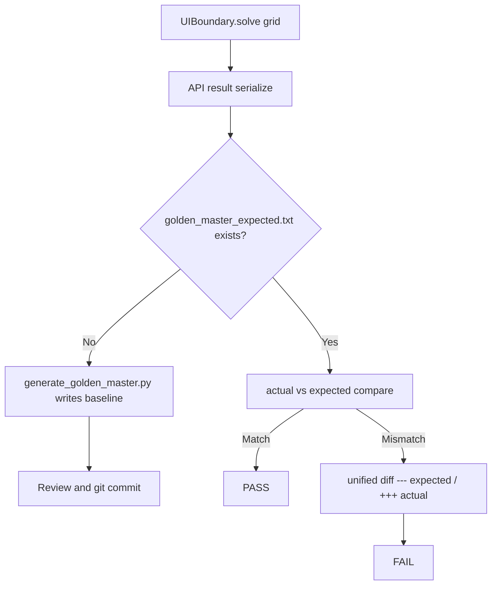

# Magic Square 4×4 — Golden Master 회귀 안전장치 Session 보고서

| 항목 | 내용 |
|------|------|
| 프로젝트 | MagicSquare_ |
| 문서 버전 | 1.0 |
| 작성일 | 2026-05-29 (KST) |
| TDD phase | **GREEN 완료 후 · REFACTOR 전** (회귀 안전장치 구축) |
| Agent | Auto (Cursor) |
| 브랜치 | `stabilize/green` |
| 선행 Report | [10_Magic-Square-Dual-Track-MVP-and-Screen-GUI-Session-Report.md](./10_Magic-Square-Dual-Track-MVP-and-Screen-GUI-Session-Report.md) |
| SSOT | [02_Magic-Square-Dual-Track-TDD-Design.md](./02_Magic-Square-Dual-Track-TDD-Design.md), `docs/PRD_MagicSquare.md` §16.4 RD-*, `docs/golden_master_approve_design.md` |
| 목적 | Golden Master baseline · approve 패턴 · GM-TC-01~05 회귀 테스트 · README GM-03 체크리스트 |

---

## 1) 작업 목표

- Track A/B GREEN 완료 후 **Refactoring 전** Solver 출력 회귀 보호 구축
- **GM-01~03:** `golden_master_expected.txt` 생성 및 버전 관리 대상 등록
- **GM-04~06:** `test_golden_master_magic_square.py` + approve 패턴 + PASS 확인
- **GM-07~10:** row-major · 1-index · reverse fallback · Error Contract 보호
- **GM-03 (README):** RED/GREEN To-Do 아래 Golden Master 체크리스트 삽입

---

## 2) 수행한 작업

| 순서 | 작업 ID | 작업 내용 | 결과 |
|------|---------|-----------|------|
| 1 | GM-1 | baseline 파일 · 생성 스크립트 · approve 설계 문서 | ✅ |
| 2 | GM-2 | per-TC 테스트 · `@pytest.mark.golden_master` · contract helpers | ✅ |
| 3 | GM-3 | README Golden Master 섹션 · pytest 73건 반영 | ✅ |
| 4 | — | RD-01/RD-02 그리드로 baseline 정정 (small-first / reverse 분리) | ✅ |
| 5 | — | Report 11 · Prompting 11 Export | ✅ (본 문서) |

---

## 3) Golden Master 아키텍처

### 3.1 Approve 패턴



- **캡처 방식:** stdout 아님 — `list[int]` `repr` / `ErrorResponse.code` 직렬화
- **비교:** `open(expected).read()` vs 조합된 actual (전체 또는 섹션 단위)
- **불일치:** `difflib.unified_diff` → pytest failure message

### 3.2 파일 구조

| 경로 | 역할 |
|------|------|
| `tests/golden_master_expected.txt` | 5 시나리오 committed baseline |
| `scripts/generate_golden_master.py` | baseline 재생성 CLI |
| `tests/golden_master/approve.py` | `build_golden_master_content`, `approve_section`, `approve_golden_master` |
| `tests/golden_master/scenarios.py` | GM-TC-01~05 그리드 · error code 매핑 |
| `tests/golden_master/contracts.py` | int[6] · row-major · 1-index · small-first · reverse · Error |
| `tests/test_golden_master_magic_square.py` | GM-2 pytest 모듈 (6 tests) |
| `docs/golden_master_approve_design.md` | approve 패턴 설계 SSOT |

---

## 4) 시나리오 · Baseline (PRD §16.4)

| Test ID | Section | 입력 (요약) | 기대 |
|---------|---------|-------------|------|
| **GM-TC-01** | `normal_success` | RD-01 `G1_RD01` | `Output: [1, 2, 2, 4, 3, 15]` — Step A small-first |
| **GM-TC-02** | `reverse_success` | RD-02 `G2` | `Output: [1, 2, 2, 4, 4, 1]` — Step B reverse |
| **GM-TC-03** | `invalid_blank_count` | G0 (빈칸 0) | `Error: UI_INVALID_EMPTY_COUNT` |
| **GM-TC-04** | `duplicate_number` | RD-05 | `Error: UI_DUPLICATE_VALUE` |
| **GM-TC-05** | `no_valid_solution` | G3 | `Error: DOMAIN_NO_SOLUTION` |

### 4.1 baseline 정정 이력

초기 GM-1 draft는 `normal_success`에 custom 4×4(Step B 결과 `[3,3,6,4,4,1]`)를 사용 — **small-first 계약 검증과 불일치**. GM-2에서 PRD **RD-01**(`G1_RD01`)로 교체하여 Step A·Step B 시나리오를 분리 고정.

---

## 5) Contract 검증 (GM-07~10)

| GM ID | 규칙 | Helper |
|-------|------|--------|
| GM-07 | row-major 빈칸 순서 | `assert_row_major_blank_order` |
| GM-08 | 1-index 좌표 (1~4) | `assert_one_index_coordinates` |
| GM-09 | reverse fallback (GM-TC-02) | `assert_reverse_fallback_combination` |
| GM-10 | Error code + non-empty message | `assert_error_contract` |

추가: GM-TC-01에서 `assert_small_first_combination`, GM-TC-01~02 공통 `assert_int6_output`.

---

## 6) pytest 현황

| 명령 | 결과 |
|------|------|
| `python -m pytest -m golden_master -v` | **6 passed** |
| `python -m pytest tests/test_golden_master_magic_square.py -v` | **6 passed** |
| `python -m pytest tests/ -q` | **73 passed** (~0.2s) |

### 6.1 Golden Master 테스트 목록

| node id | 설명 |
|---------|------|
| `test_gm_tc_01_normal_success` | RD-01 + baseline section approve |
| `test_gm_tc_02_reverse_success` | RD-02 + reverse contract |
| `test_gm_tc_03_invalid_blank_count` | UI_INVALID_EMPTY_COUNT |
| `test_gm_tc_04_duplicate_number` | UI_DUPLICATE_VALUE |
| `test_gm_tc_05_no_valid_magic_square` | DOMAIN_NO_SOLUTION |
| `test_gm_tc_all_sections_full_baseline` | GM-1 aggregate full-file compare |

### 6.2 pytest 마커

`pyproject.toml` · `tests/conftest.py`:

```toml
markers = ["golden_master: GM-2 Golden Master regression (approve pattern)"]
```

---

## 7) README · 문서 동기화

### 7.1 README (`GM-03`)

`## TDD RED / GREEN To-Do (체크리스트)` 직후 **Golden Master 회귀 안전장치** 섹션 추가:

- GM-01~10 체크리스트 (전부 `[x]`)
- `generate_golden_master.py` · `pytest -m golden_master -v` 명령
- pytest 카운트 **67 → 73** 갱신

> 참고: 사용자가 `@docs/README.md`를 지정했으나 해당 파일은 없음 — 루트 `README.md`에 반영.

### 7.2 미존재 파일명 문의

`tests/test_gm_01_magic_square_golden_master.py` — **미생성**. GM-2에서 `tests/test_golden_master_magic_square.py`로 통합; 구 `test_gm_01_golden_master.py`는 삭제됨.

---

## 8) Git · 버전 관리

| 항목 | 상태 |
|------|------|
| `git add tests/golden_master_expected.txt` | GM-03 요구 — staging 수행 (커밋은 사용자 요청 시) |
| `stabilize/green` | 작업 브랜치 |
| Forbidden 준수 | `print()` 없음 · 테스트 assert 완화 없음 · ECB 유지 |

---

## 9) ECB · 계약 준수

| 규칙 | 상태 |
|------|------|
| Golden Master 테스트 — real `solution` (Mock 금지) | ✅ |
| Boundary error code Report 02 §2.4 | ✅ |
| `entity` → `boundary` import 금지 (`contracts.py`는 tests만) | ✅ |
| baseline error block — code only (message drift 방지) | ✅ |

---

## 10) 미완료 · 후속

| 항목 | 상태 |
|------|------|
| `test_gm_01_magic_square_golden_master.py` alias | 미생성 (필요 시 thin re-export) |
| Golden Master CI job (`pytest -m golden_master`) | 선택 후속 |
| REFACTOR 브랜치 + 커버리지 80%+ | Report 10 후속과 동일 |
| baseline 변경 시 PR 리뷰 규칙 문서화 | 선택 |

---

## 11) Traceability

| ID | 산출 |
|----|------|
| GM-01 | `golden_master_expected.txt`, `scripts/generate_golden_master.py` |
| GM-02 | `test_golden_master_magic_square.py`, GM-TC-01~05 |
| GM-03 | README Golden Master 섹션 |
| GM-04~06 | 테스트 · approve · PASS |
| GM-07~10 | `tests/golden_master/contracts.py` |
| PRD RD-01 / RD-02 | GM-TC-01 / GM-TC-02 그리드 SSOT |
| Report 02 §2.2 Output `int[6]` | contract helpers |

---

## 12) 참고 문서

- [docs/golden_master_approve_design.md](../docs/golden_master_approve_design.md)
- [docs/PRD_MagicSquare.md](../docs/PRD_MagicSquare.md) §16.4
- [Report/10_Magic-Square-Dual-Track-MVP-and-Screen-GUI-Session-Report.md](./10_Magic-Square-Dual-Track-MVP-and-Screen-GUI-Session-Report.md)
- [README.md](../README.md)
- [Prompting/11_Magic-Square-Golden-Master-Regression-Session-Transcript-Prompt.md](../Prompting/11_Magic-Square-Golden-Master-Regression-Session-Transcript-Prompt.md)

---

## 문서 이력

| 버전 | 날짜 | 변경 |
|------|------|------|
| 1.0 | 2026-05-29 | GM-1~3 Golden Master baseline · GM-2 tests · README · Report/Prompting 11 — 최초 작성 |

---

*본 문서는 GREEN 완료 후 Refactoring 전 Golden Master 회귀 안전장치 구축 세션 산출물입니다.*
