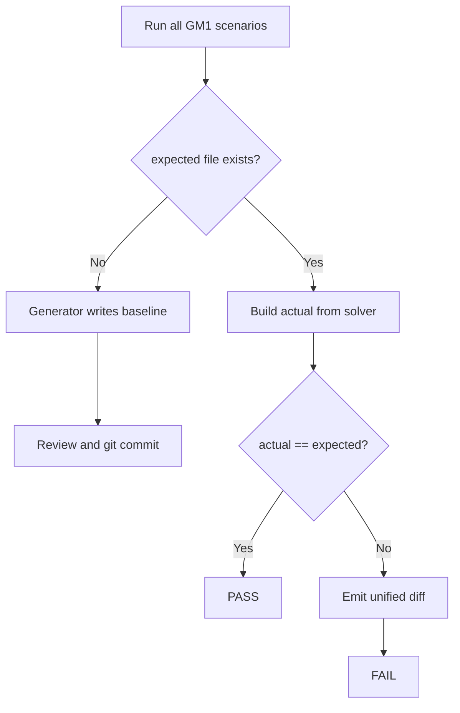

# GM-1 / GM-2 Golden Master — Approve Pattern Design

## Purpose

GM-1 (aggregate baseline) and GM-2 (per-scenario tests) protect the Magic Square Solver **public contract** against silent regressions. The baseline file captures **actual Boundary + Control output** for five fixed scenarios; pytest compares live output using an **approve** workflow.

## Scope

| Item | Value |
|------|-------|
| Test IDs | GM-1 (full file), GM-TC-01~05 (GM-2) |
| Baseline file | `tests/golden_master_expected.txt` |
| Test module | `tests/test_golden_master_magic_square.py` |
| Generator | `scripts/generate_golden_master.py` |
| Helpers | `tests/golden_master/approve.py`, `contracts.py`, `scenarios.py` |
| Marker | `@pytest.mark.golden_master` |

## Scenarios (PRD §16.4 RD-*)

| Test ID | Section | Grid | Expected |
|---------|---------|------|----------|
| GM-TC-01 | `normal_success` | RD-01 (`G1_RD01`) — small-first | `Output: [1, 2, 2, 4, 3, 15]` |
| GM-TC-02 | `reverse_success` | RD-02 (`G2`) — reverse fallback | `Output: [1, 2, 2, 4, 4, 1]` |
| GM-TC-03 | `invalid_blank_count` | G0 — zero empties | `Error: UI_INVALID_EMPTY_COUNT` |
| GM-TC-04 | `duplicate_number` | RD-05 | `Error: UI_DUPLICATE_VALUE` |
| GM-TC-05 | `no_valid_solution` | G3 | `Error: DOMAIN_NO_SOLUTION` |

Solver path: `UIBoundary(execute=solution).solve(grid)` — API result serialization (not stdout).

## Baseline file format

Each section:

```text
[section_name]
Input:
<space-separated 4×4 rows>
Output:
[int list repr]
```

or for failures:

```text
Error:
<error code only>
```

Sections are separated by:

```text
________________________________________
```

Success output uses Python `repr` of the six-element list (e.g. `[3, 3, 6, 4, 4, 1]`). Error blocks store **code only** (Report 02 §2.4), not the full message, so wording tweaks do not invalidate the baseline.

## Approve pattern



### Behaviors

1. **Baseline missing (generator / first run)**  
   `scripts/generate_golden_master.py` writes `tests/golden_master_expected.txt` from current solver output. Review and commit.

2. **Baseline present (pytest GM-2)**  
   Each `test_gm_tc_*` rebuilds its section block, asserts contract rules, then compares to the parsed section in the baseline file. `test_gm_tc_all_sections_full_baseline` compares the entire file (GM-1 aggregate).

3. **Mismatch**  
   `approve_section` / `approve_golden_master` emit **unified diff** (`--- expected` / `+++ actual` / `@@` hunk headers); pytest fails with that diff.

4. **Intentional contract change**  
   Re-run the generator after verifying the new behavior is correct, then commit the updated baseline:

   ```bash
   python scripts/generate_golden_master.py
   git add tests/golden_master_expected.txt
   ```

## Contract checks (GM-2)

| Rule | Assertion helper |
|------|------------------|
| `int[6]` format | `assert_int6_output` |
| 1-index coordinates | `assert_one_index_coordinates` |
| Row-major blank order | `assert_row_major_blank_order` |
| Small-first (GM-TC-01) | `assert_small_first_combination` |
| Reverse fallback (GM-TC-02) | `assert_reverse_fallback_combination` |
| Error contract | `assert_error_contract` |

## Commands

```bash
# Create or refresh baseline from current solver
python scripts/generate_golden_master.py

# Run GM-2 regression only
python -m pytest -m golden_master -v

# Full suite (includes GM-2)
python -m pytest tests/ -q
```

## Design notes

- **Result DTO serialize** (not stdout): `ErrorResponse.code` for failures; `repr(list[int])` for success — stable and layer-accurate.
- **No Mock**: GM-1 uses the real Control `solution` callable, consistent with Track B / IT tests.
- **Single file**: One baseline simplifies review and diff; section parsers in `approve.py` allow future per-section tests if needed.
- **Version control**: `golden_master_expected.txt` must be tracked; CI fails when solver output drifts without an approved baseline update.
